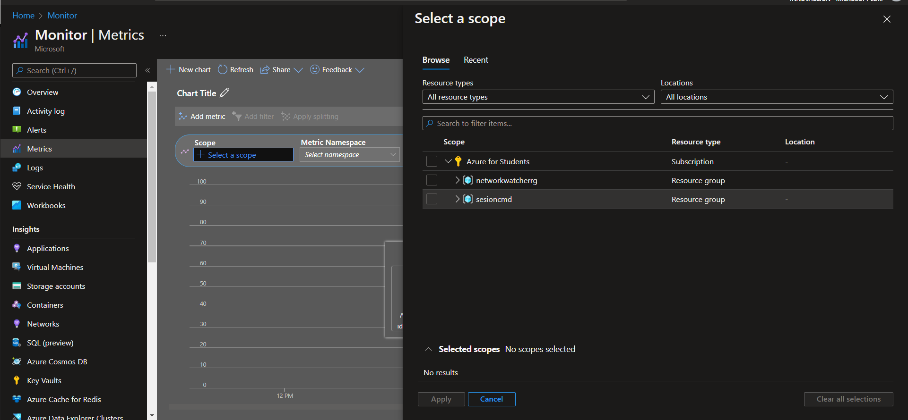
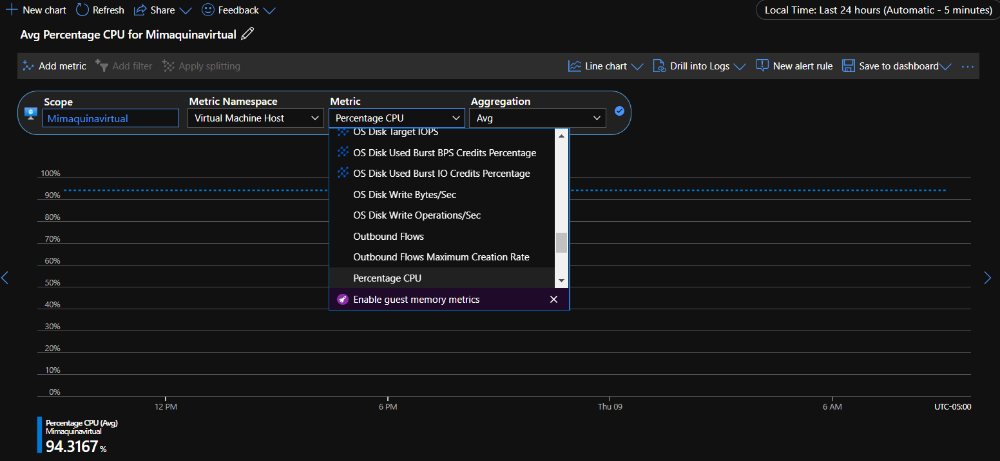
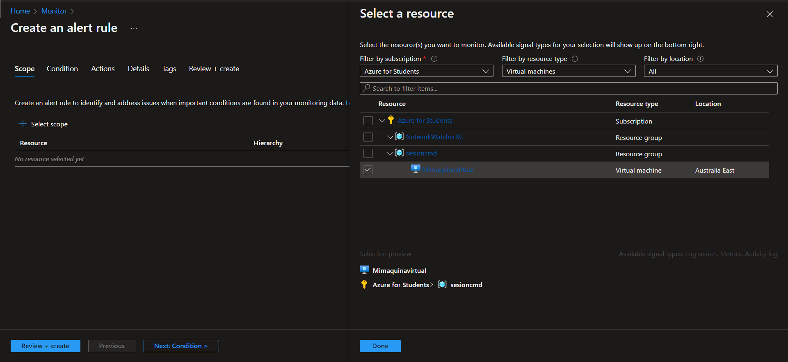
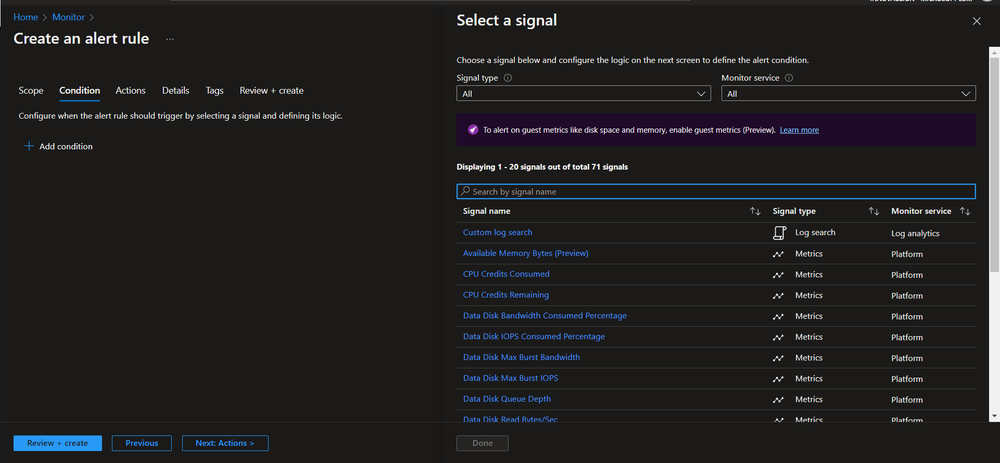
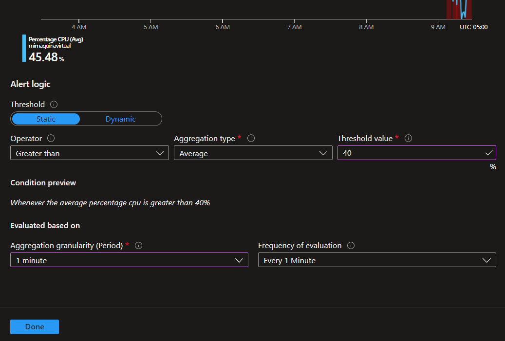
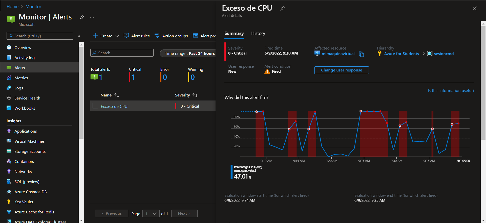

# En este apartado se aprendera a ver los usos de Azure Monitor

Primero deberemos ir a [Portal Azure](https://portal.azure.com/#home) e iremos al apartado de monitor y nos buscaremos metricas 

Escojeremos el recurso que queremos monitoriar, cuando escojamos el recurso y aplicamos podremos escojer que es lo que queremos monitoriar del recurso

Para crear una alarma nos iremos al apartado de alarmas y crearemos una, al ingresar al apartado tendremos que seleccionar "filtrar por tipo de recursos" y escribir el nombre del recurso ya sea maquina virtual o lo que guste monitoriar despues buscaremos en "elementos de filtro" el recurso que deseamos monitoriar

Ahora nos iremos al apartado de condiciones y escojeremos lo que queremos que monitorie nuestro monitor

Despues tendremos que configuar nuestro monitoreo como el tiempo en que queremos que monitorie 

Una vez creado regresaremos a alerta y nos aparecera si hemos rebasado nuestros parametro que hemos configurado

